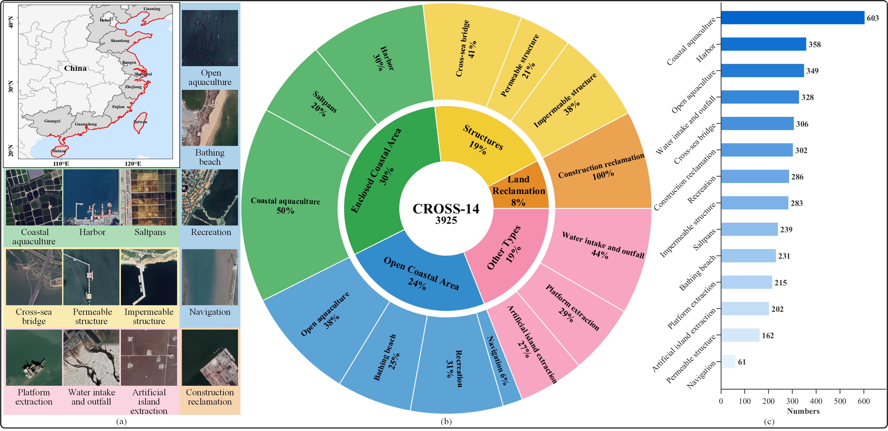
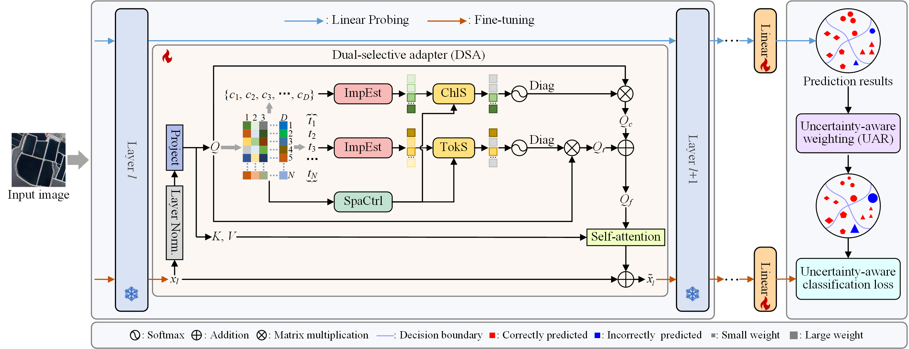

# Empowering Vision Foundation Models via Multi-Granularity Selective Fine-tuning for Remote Sensing Scene Classification of Coastal Zones
## CROSS-14 Dataset

CROSS-14 is a dedicated benchmark for coastal remote sensing scene classification. It contains 3,925 images (640×640) covering the entire Chinese coastal zone, collected from Google Earth Engine with 1 m spatial resolution. The dataset includes 14 fine-grained coastal use patterns and exhibits notable challenges such as high inter-class similarity, intra-class heterogeneity, and strong background redundancy caused by large homogeneous sea surfaces.

the dataset is avaliable at：https://pan.baidu.com/s/1FSQz4Dyi-gO0PzV-bu0E9A?pwd=tue1

The link of Google griver: https://drive.google.com/file/d/1tQFQQXOCkb-2iaF0NhB9u_O45db04HkD/view?usp=sharing
##MGSF

## How to run
1. Run `train_linear.py` for linear probing.  
2. Run `modify_weights.py` to compute uncertainty-aware sample weights.  
3. Run `train_atten.py` to train with token- and channel-granularity selection.
